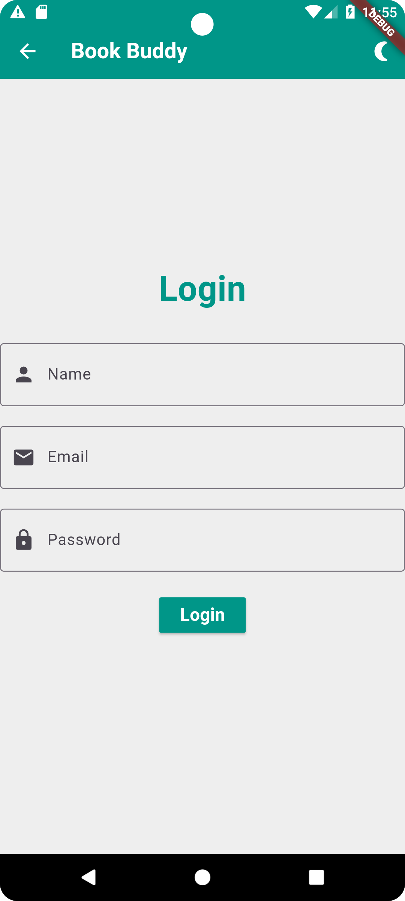
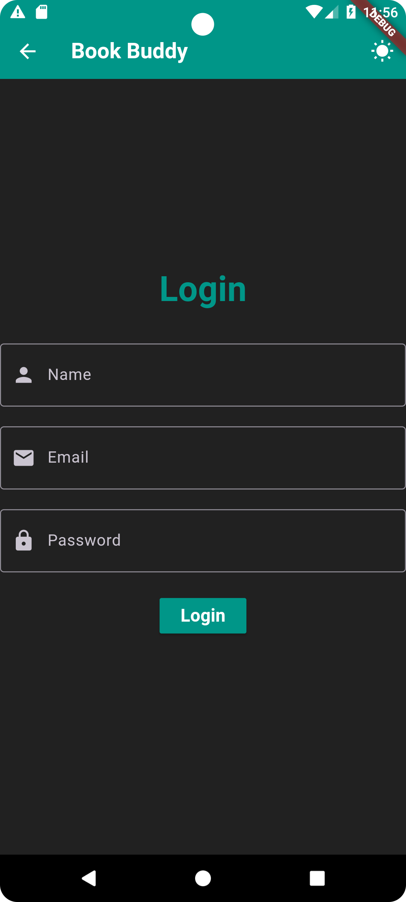
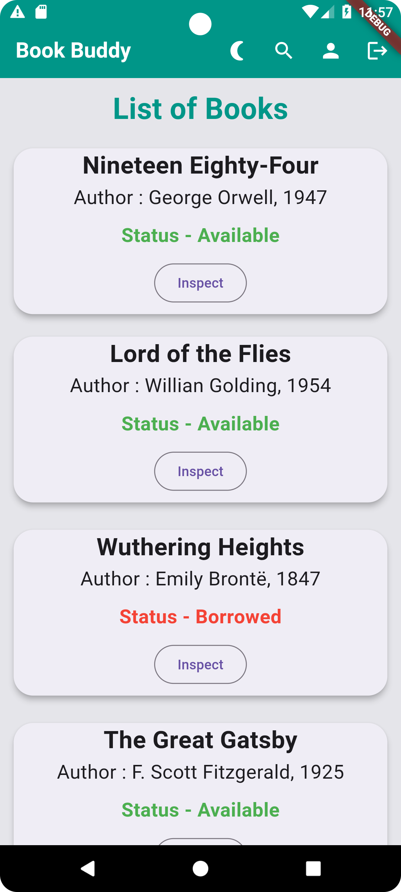
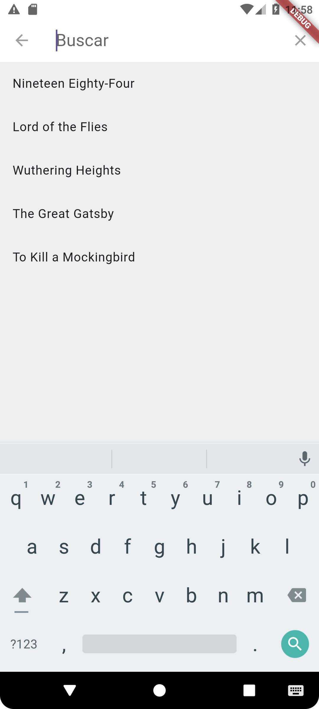
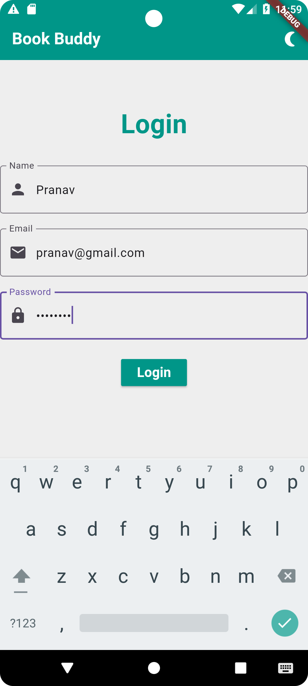
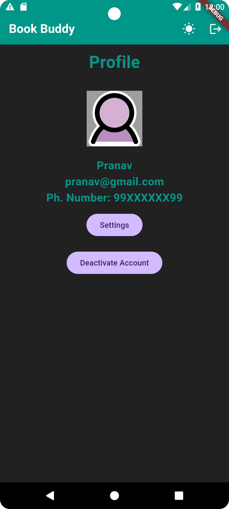

## Book Buddy App

This repository contains the source code for the Book Buddy mobile app built with Flutter.

### Description

Book Buddy is a mobile application that allows users to manage their book collection, browse available books, and perform various actions related to book borrowing and reading.

### Features

- **User Authentication**: Users can log in using their name, email, and password.
- **Dark Mode Support**: The app supports both light and dark themes.
- **Book Listing**: Displays a list of available books with details like title, author, and status.
- **Search Functionality**: Users can search for books by title.
- **Profile Management**: Users can view and update their profile information.
- **Responsive Design**: The app is designed to work on various screen sizes.
- **Language Localization**: Implemented a basic translation that can be done in the backend using Localization.

### Screenshots

**Login Page**:
</br>


**Login Page - Dark Mode**:
</br>


**Home Page**:
</br>


**Search Functionality**:
</br>


**Shared Preferences - Stored Same Data locally and displayed in Profile Page**:
</br>


**Profile Page**:
</br>


**Profile Page - Dark Mode**:
</br>


**Language Localization**:
</br>


### Getting Started

To run this app locally, follow these steps:

1. **Prerequisites**:
   - Flutter SDK installed
   - Android Studio or VS Code with Flutter plugins

2. **Clone the repository**:
   ```bash
   git clone https://github.com/Guruprasath-K/book_buddy_flutter.git

3. **Open in Android Studio**:
   - Launch Android Studio.
   - Click on "Open an existing Android Studio project."
   - Navigate to the cloned repository and select the book-buddy directory.
   - Wait for the project to sync and install dependencies.

 4. **Run the app**:
   - Ensure you have an emulator running or a device connected.
   - Click on the green play button in Android Studio to build and run the app.

### Contributing

Contributions are welcome! Please follow these guidelines:

1. **Fork the repository**.
2. **Create your feature branch** (`git checkout -b feature-name`).
3. **Commit your changes** (`git commit -am 'Add some feature'`).
4. **Push to the branch** (`git push origin feature-name`).
5. **Create a new Pull Request**.

### License

This project is licensed under the [MIT License](LICENSE).
